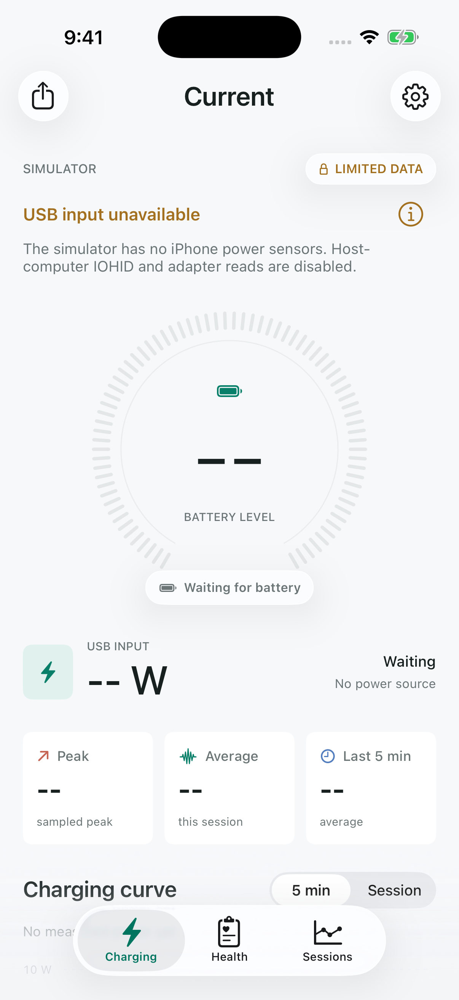

# Current

Current shows USB charging power, battery temperature, and charging history on iPhone and iPad.

Requires iOS 26 or later. Power readings need a wired connection.

<p align="center">
  
</p>

*Simulator preview. Live power and temperature readings require a physical device.*

## Features

- Live USB input power, peak power, and five-minute and session averages.
- Charging charts for the last five minutes or the full session.
- Battery temperature, USB voltage and current, and adapter rating.
- Session duration, energy input, and battery-level changes.
- Saved sessions and JSON export.

You can choose light, dark, or system appearance in Settings.

## Run

1. Open `Current.xcodeproj` in Xcode 26 or later.
2. For a physical device, select the Current target, open Signing & Capabilities, and choose your team. Leave automatic signing enabled.
3. Select the Current scheme, choose your device or a simulator, and Run.

For device tests, choose a team for CurrentTests and CurrentUITests too. Use a real device for power and temperature readings; the simulator is useful for checking the interface.

## About the readings

Power is estimated from the USB voltage and current sensors. It includes power used by the phone itself, not just power going into the battery. It is also different from power drawn at the wall. The adapter rating is shown separately.

The app samples every two seconds. The peak is the highest recorded reading, so short spikes may be missed. Averages and energy totals use the time between valid samples, leaving out intervals with missing readings or gaps longer than ten seconds.

Current uses private iOS APIs, and the available readings vary by device and iOS version. Some values may be unavailable. Battery health percentage, capacity, cycle count, and wireless charging power are not supported.

This app is intended for personal use and development, not App Store distribution.

## Sessions

Sessions cover the time the app is active. Unplugging, locking the device, or leaving the app ends the current session. Returning while connected starts a new one.

Current keeps up to 30 saved sessions on your device. You can export readings as JSON from the share button.

The Keep screen on setting prevents auto-lock while recording. Leaving the screen on also affects the phone's power use.

## Development

Run tests with Product → Test in Xcode, or use the commands below. Choose a simulator installed on your Mac.

```sh
xcrun simctl list devices available
swiftformat Current CurrentTests CurrentUITests Scripts
swiftlint lint --strict
xcodebuild -project Current.xcodeproj -scheme Current \
  -destination 'platform=iOS Simulator,name=iPhone 17 Pro,OS=26.5' \
  -derivedDataPath .build -parallel-testing-enabled NO \
  CODE_SIGNING_ALLOWED=NO test
```

UI tests save screenshots in the test results. `Scripts/GenerateAppIcon.swift` redraws the app icon.

Before committing, leave out personal signing changes, credentials, and device logs. Xcode saves team selections in the tracked project file, so `.gitignore` does not exclude those changes.

## Credits

The sensor approach was informed by Greg Wilson's **ios-charging-monitor**. See [THIRD_PARTY_NOTICES.md](THIRD_PARTY_NOTICES.md) for attribution and its MIT license notice.
